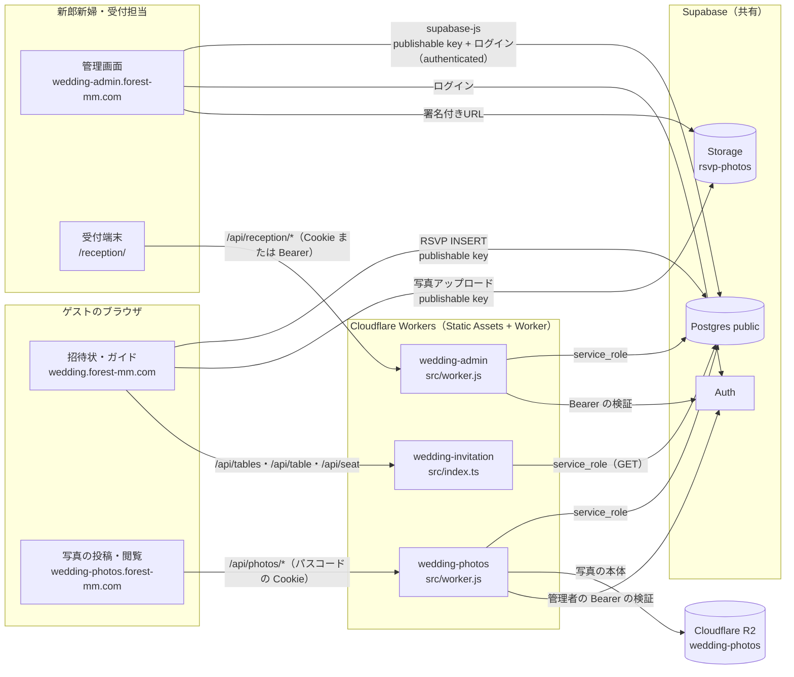

# システム全体仕様 — wedding-invitation / wedding-admin / wedding-photos

> 正本は wedding-invitation の `00_spec/00_system_overview.md`。wedding-admin・wedding-photos の同名ファイルはそのコピー。

3つの Cloudflare Workers と、共有の Supabase（Postgres・Auth・Storage）で構成する。DB の詳細は [`05_database.md`](05_database.md)。

- 個人データ（氏名・メール・住所など）はこの文書に書かない。
- Secrets は名前だけを書き、値は書かない。
- 「未検証：ダッシュボードで確認」は、コード（リポジトリ）からは確認できない項目。

---

## 1. 全体像

---

## 2. リポジトリとデプロイ

| | wedding-invitation | wedding-admin | wedding-photos |
|---|---|---|---|
| GitHub | forestcat-mm/wedding-invitation | forestcat-mm/wedding-admin | forestcat-mm/wedding-photos |
| ローカルのフォルダ | `../wedding-invite` | `../wedding-admin` | `../wedding-photos` |
| 設定ファイル | `wrangler.jsonc` | `wrangler.toml` | `wrangler.toml` |
| Worker の name | `wedding-invitation` | `wedding-admin` | `wedding-photos` |
| main | `src/index.ts` | `src/worker.js` | `src/worker.js` |
| compatibility_date | `2026-09-24` | `2026-09-24` | `2026-09-01` |
| assets.directory / binding | `./public` / `ASSETS` | `./public` / `ASSETS` | `./public` / `ASSETS` |
| html_handling | `auto-trailing-slash` | `auto-trailing-slash` | 未設定（既定値） |
| not_found_handling | `404-page`（**404 ページは無い**） | `404-page`（**404 ページは無い**） | `404-page`（**404 ページは無い**） |
| run_worker_first | `["/api/*"]` | `["/r/*", "/api/*"]` | `["/api/*", "/live", "/live/", "/", "/index.html", "/gallery", "/gallery/*", "/upload", "/upload/*", "/mine", "/mine/*"]` |
| vars（値は公開情報のみ） | なし | `SUPABASE_URL`、`SUPABASE_ANON_KEY`（publishable）、`ADMIN_EMAILS`、`ADMIN_EMAIL_DOMAIN` | `PHOTOS_UPLOAD_CLOSE_DATE`（`2026-09-30`）、`PHOTOS_DOWNLOAD_CLOSE_DATE`（`2026-10-31`）。`keep_vars = true` |
| その他のバインディング | なし（KV・R2・D1 なし） | なし | R2 `PHOTOS_BUCKET`（バケット `wedding-photos`） |
| Secrets（名前のみ） | `SUPABASE_URL`、`SUPABASE_SERVICE_ROLE_KEY` | `SUPABASE_SERVICE_ROLE_KEY`、`RECEPTION_COOKIE_SECRET` | `SUPABASE_URL`、`SUPABASE_SERVICE_ROLE_KEY`、`PHOTOS_PASSCODE`、`SESSION_SECRET`、`ADMIN_EMAILS`、`ADMIN_TOKEN`、`LIVE_GUEST_TOKEN`、`BRIDE_NAME`、`GROOM_NAME` |
| カスタムドメイン | `wedding.forest-mm.com`（`wrangler.jsonc` に routes は無く、コメントで「ダッシュボードで設定」） | `wedding-admin.forest-mm.com`（画面の表記から。`wrangler.toml` に routes は無い） | `wedding-photos.forest-mm.com`（README。`wrangler.toml` に routes は無く、ダッシュボードで設定。`workers.dev` は無効化） |

根拠：`wedding-invite/wrangler.jsonc` L3–14、`wedding-admin/wrangler.toml` L1–22、`wedding-photos/wrangler.toml` L1–35。

- 3つとも Pages ではなく **Workers（Static Assets + Worker）**。`run_worker_first` に挙げたパスだけ Worker が先に受け、それ以外は `public/` の静的ファイルを返す。
- `not_found_handling = "404-page"` だが、3つとも `public/404.html` が無い（そのときの応答は未検証）。

**検証済み（2026-10-06）**：表の各値は設定ファイルとコードで確認。カスタムドメインの割り当て、Secrets が実際に登録されているかは **未検証：ダッシュボードで確認**。

---

## 3. wedding-invitation（招待状・ウェディングガイド）

### 3.1 ページ（`public/`）

| パス | 内容 |
|---|---|
| `/` | 招待状（日本語）。RSVP フォームは CSS で閉じ、お礼のカードを表示（送信の JavaScript は残っている） |
| `/zh/` | 招待状（中国語）。構成は `/` と同じ |
| `/guide/`、`/guide/story/`、`/guide/seating/`、`/guide/menu/`、`/guide/marche/` | ウェディングガイド（日本語）。各ページは `data-page` で区別する殻で、`guide/assets/guide.js` が描画。`noindex` |
| `/zh/guide/…` | ウェディングガイド（中国語）。同じ5ページ |
| `/guide/content/guide.ja.json`、`guide.zh.json` | ガイドの文言・写真のパス（JSON） |
| `/guide/photos/…`、`/images/…` | 画像 |

`_headers`・`_redirects`・404 ページは無い。README にある `/book/` は未作成。

### 3.2 Worker のルート（`src/index.ts`）

| メソッド・パス | 行 | 内容 | キャッシュ |
|---|---|---|---|
| `GET /api/tables` | L182–188 | 卓の一覧 `[{label, capacity, grid_row, grid_col}]`（定員0・位置なしは除く）。個人データなし | `public, max-age=60` |
| `GET /api/table?label=X` | L190–197 | 卓の席と着席者 `{label, capacity, seats:[{seat_index, name_ja, name_latin, child, title, comp}]}` | `no-store` |
| `GET /api/seat?q=` | L199–213 | 席の検索（氏名の部分一致、メールは完全一致）。最大5件。メールは返さない。IP ごとに 60 秒 30 回まで（インスタンス内メモリ、超えたら 429） | `no-store` |

- `/api/*` は GET 以外 405、未定義のパスは 404。応答には `x-robots-tag: noindex`（L22–31、L180、L215）。
- DB はすべて service_role で読む。60 秒のメモリ内スナップショット（L86–157）。

### 3.3 JSON（`public/guide/content/guide.<lang>.json`）

トップレベルのキー：`greeting`、`story`、`menu`、`marche`、`links`（ja・zh で同じ構造）。

- `greeting`：`hero`、`kicker`、`names`、`date`、`title`、`body`、`cards[]`（`{en, key, photo, text}`）
- `story`：`chapter1`（`bride`・`groom`、各 `items[]{year, title, text, photo}`）、`chapter2`、`chapter3`、`honeymoon[]`、`closing` ほか
- `menu`：`courses[]{no, name, sub}`、`drinks[]`、`special` ほか
- `marche`：`sections[]{id, en, title, note, items[]{id, brand, name, detail, photo}}` ほか
- `links`：`photos`（`https://wedding-photos.forest-mm.com/`）、`invitation`

ゲストの個人データは含まない。

### 3.4 Supabase へのアクセス

| 場所 | キー | 対象 | 操作 |
|---|---|---|---|
| `public/index.html` L925–930（`/zh/` も同じ） | publishable | `rest/v1/rsvp` | INSERT（`Prefer: return=minimal`） |
| `public/index.html` L761–769（`/zh/` も同じ） | publishable | Storage `rsvp-photos`（`<YYYYMMDD>/<uuid>.<ext>`） | アップロード |
| `src/index.ts` L94–100 | service_role | `seating_tables`、`seating_assignments`、`reply_people`、`replies_admin`、`guests` | SELECT |

supabase-js・RPC・Auth は使っていない。

### 3.5 旧ドメインからのリダイレクト（README L5–6、L56–68）

- 旧 URL `https://wedding-invitation.forest-mm.com/`（Pages）から新 URL `https://wedding.forest-mm.com/` へ **301**。
- 方法は Cloudflare のゾーン `forest-mm.com` の **Redirect Rules**（条件：Hostname が `wedding-invitation.forest-mm.com`、転送先は同じパスを保って新ドメインへ、クエリ文字列を保持）。
- 旧ホスト名には Proxied の DNS レコードを残す（CNAME またはダミーの AAAA `100::`）。
- README は WAF のレート制限（`/api/seat` に毎分 30 回）を任意の設定として挙げている（L79–81）。

**検証済み（2026-10-06）**：3.1〜3.4 はコードで確認。3.5 のリダイレクトルール・DNS・WAF が実際に設定されているかは **未検証：ダッシュボードで確認**（README の手順の記述のみ確認）。

---

## 4. wedding-admin（管理画面・受付）

### 4.1 ページ（`public/`）

| パス | 内容 | 認証 |
|---|---|---|
| `/` | 管理画面（ダッシュボード・ゲスト一覧・投稿写真・予算・ご祝儀・配席・友人圏・受付トークン） | Supabase Auth（メール＋パスワード）。受付トークンの端末は権限不足画面 |
| `/reception/` | 当日の受付画面 | 受付 Cookie（トークン）または管理者のログイン |
| `/gift-check/` | 引出物・引菓子 確認リスト（上部タブには出さない臨時ページ） | 管理者のログイン |
| `/s/` | 友人圏ごとの共有ページ（出席者の氏名だけ） | トークン＋パスワード（RPC `share_lookup`） |

### 4.2 Worker のルート（`src/worker.js`）

| メソッド・パス | 行 | 内容 |
|---|---|---|
| `GET /r/:code` | L26、L150– | 受付トークンの短縮URL。有効なら署名付き Cookie `rcpt` を発行して `/reception/` へ 302 |
| `GET /api/reception/me` | L212 | 認証の確認（`via: token / admin`、既定サイド、受付IDの ON/OFF） |
| `GET /api/reception/guests` | L217 | 受付用のゲスト一覧（出席予定かつ配席済み。連絡先などは含めない） |
| `POST /api/reception/checkin` | L225 | 受付済み／取り消し |
| `POST /api/reception/items/:id/hand` | L235 | お渡し済み／取り消し |
| その他の `/api/*` | L28 | 404 |

- 認証（L171–）：Cookie（HMAC 署名＋DB でトークンの有効・期限を毎回確認）、または `Authorization: Bearer <Supabase のアクセストークン>`（`/auth/v1/user` で検証し、`ADMIN_EMAILS` か `ADMIN_EMAIL_DOMAIN` のメールだけ許可）。
- DB はすべて service_role（L55–56）。ご祝儀の表（`gifts` など）は読まない。

### 4.3 Supabase へのアクセス

- 管理画面（`public/app.js`）・`/gift-check/`・`/reception/` のログインは **supabase-js（publishable key）＋ Supabase Auth**。ログイン後は `authenticated` ロールで RLS を通る。
- `/s/` は publishable key（anon）で RPC `share_lookup` を呼ぶ。
- 受付端末（トークン）は Supabase に直接つながず、Worker の `/api/reception/*` 経由。
- 詳細は `05_database.md` の「アクセス経路の対応表」。

**検証済み（2026-10-06）**：4.1〜4.3 はコードで確認。カスタムドメイン `wedding-admin.forest-mm.com` の割り当て、Supabase Auth のユーザー登録状況は **未検証：ダッシュボードで確認**。

---

## 5. wedding-photos（写真の投稿・ライブ表示）

ゲストが撮った写真・動画を投稿し、会場のスクリーン（ライブ画面）に表示する「PHOTO TOSS」。中国本土からも届くよう、外部 CDN・Google Fonts・`workers.dev` は使わない（README L9）。

### 5.1 ページ（`public/`、すべて `noindex, nofollow`）

| パス | 内容 |
|---|---|
| `/` | 入口（パスコード＋新郎新婦の名前、QR からの自動ログイン） |
| `/upload/`、`/upload/simple/` | 投稿（チェキ風／まとめて投稿） |
| `/gallery/` | ギャラリー（投票・絞り込み・ZIP 保存） |
| `/mine/` | 自分の投稿（メッセージの編集・削除） |
| `/live/` | 会場のライブ画面（3D 表示）。`?token=` で会場用 Cookie を発行 |
| `/admin/` | 管理画面（Supabase Auth でログイン） |

文言は `public/i18n/translations.json`（キーごとに `ja`・`zh`、一部 `en`）。

### 5.2 Worker のルート（`src/worker.js`）

- `/api/photos/*` を `src/api/` の各ハンドラに振り分け、それ以外は静的ファイル（L65–87、L125–148）。
- `/live?token=`：`ADMIN_TOKEN` なら管理者、`LIVE_GUEST_TOKEN` ならゲストの会場用 Cookie `ps_live` を発行して `/live/` へ 302（L69–74）。トークンも Cookie も無ければ 403（L77–81）。
- ダウンロードの締切（`PHOTOS_DOWNLOAD_CLOSE_DATE`）の後は、ゲスト向けのページと API がすべて 404。`/admin/` と `/live/` は使える（README L874–879）。
- 投稿の締切（`PHOTOS_UPLOAD_CLOSE_DATE`）の後は、書き込み系（`init`・`single`・`part`・`thumb`・`medium`・`complete`・`votes`、`mine` の更新）が 410（L46、L119–121）。

| 認証 | 方式 |
|---|---|
| ゲスト | `POST /api/photos/auth`（パスコード＋名前）→ HMAC 署名の Cookie `ps_session`（`SESSION_SECRET`） |
| 会場の画面 | Cookie `ps_live`（30日。役割は admin / guest） |
| 管理者 | `Authorization: Bearer <Supabase のアクセストークン>` を `/auth/v1/user` で検証し、`ADMIN_EMAILS` と照合（`src/lib/admin-auth.js` L25–46） |
| 端末の識別 | ヘッダー `X-Device-Id`（自分の投稿の編集・削除、投票） |

主な API：`auth`・`session`、投稿（`init`→`single` / `part`→`thumb`・`medium`→`complete`）、`list`・`facets`・`file/{id}/{thumb|medium|original}`、`mine`、`votes`、管理者用（`hide`・`stats`・`cleanup`・`bulk`・`awards`・`live-settings`・`live-ticket`）。

### 5.3 データの置き場所

- 写真・動画の本体：**Cloudflare R2**（バケット `wedding-photos`、バインディング `PHOTOS_BUCKET`）。署名付きURLは使わず、すべて Worker 経由で配信（README L900–901）。
- メタデータ：Supabase の `photos`・`votes`・`awards`・`award_photos`・`live_settings`、ビュー `photos_ranked`。**RLS 有効・ポリシーなしで、Worker の service_role だけが読み書きする**（README L254–257、`src/lib/supabase.js`）。
- ブラウザから Supabase に直接つなぐのは管理画面のログイン（Auth）だけ（`public/js/admin.js` L835–836）。

### 5.4 ツール（ローカルで実行）

- `tools/import-rsvp-photos.mjs`：招待状の RSVP に添付された写真（Storage `rsvp-photos`）を PHOTO TOSS に取り込む。Supabase は service_role で読み（`../wedding-invite/.dev.vars`）、書き込みは Worker の API 経由。
- `tools/loadtest.mjs`：負荷試験（Worker の API のみ）。
- デプロイは `npx wrangler deploy`。GitHub 連携（Workers Builds）を設定していれば main への push で自動実行（README L230–236）。

**検証済み（2026-10-06）**：5.1〜5.4 はコードと README で確認。カスタムドメイン、`workers.dev` の無効化、9 つの Secrets の登録、Workers Builds の連携は **未検証：ダッシュボードで確認**。

---

## 6. Supabase（共有）

- プロジェクト：`cvnqnvnppvfhwmrehagt`（URL はコードに記載。キーの値はここに書かない）。
- public スキーマに 29 テーブル・1 ビュー（`photos_ranked`）・12 関数。Storage バケットは `rsvp-photos`（非公開）1つ。
- RLS は全テーブルで有効。ポリシーは、管理画面用の表に `authenticated` の ALL、`rsvp` に anon の INSERT と authenticated の SELECT、Storage `rsvp-photos` に anon の INSERT と authenticated の SELECT。wedding-photos の表（`photos` など）と `couple_messages` はポリシー 0 件（service_role 専用）。anon に SELECT を許可するポリシーは無い。
- 詳細は [`05_database.md`](05_database.md)。

**検証済み（2026-10-06）**：Supabase から抽出したスキーマ CSV（2026-10-06）で確認。

---

## 7. キーとアクセスの境界

| キー | 使う場所 | できること |
|---|---|---|
| publishable（anon） | 招待状のブラウザ、wedding-admin の `/s/` | `rsvp` の INSERT、`rsvp-photos` へのアップロード、RPC `share_lookup`（ほかは RLS で拒否） |
| publishable ＋ Auth（authenticated） | wedding-admin の管理画面・`/gift-check/`・`/reception/`、wedding-photos の `/admin/`（ログインのみ） | 管理画面用の表すべて（`admin all` ポリシー）。**ログインできるユーザーなら誰でも**（下の注） |
| service_role | 3つの Worker（Secret）、wedding-photos のローカルの取り込みツール | RLS を通らずに読み書き。各 Worker のコードで操作を限定 |

- 注：DB のポリシーは `authenticated` 全体に許可しており、管理者かどうか（メールのドメイン）は Worker と画面側だけで判定している。Auth に管理者以外のユーザーを作らない運用が前提（**要確認**：ダッシュボードで新規登録を止めているか）。

---

## 8. 要確認・未検証の一覧

- **未検証：ダッシュボードで確認**：3つの Worker のカスタムドメイン、Secrets の登録（wedding-photos は 9 つ）、旧ドメインの Redirect Rule と DNS、WAF のレート制限、wedding-photos の `workers.dev` の無効化と Workers Builds の連携、Supabase Auth のユーザーと新規登録の設定。
- **要確認**：wedding-invitation の README L24 は `.dev.vars` を「今は空」と書いているが、実際には変数名が定義されている（値は確認していない）。README の記述を更新するか。
- **要確認**：3つとも `not_found_handling = "404-page"` だが 404 ページ（`public/404.html`）が無い。
- **要確認**：wedding-photos の仕様 v11 で削除とされた `couple_messages` と `live_settings` の音楽の列が DB に残っている（`05_database.md` 7 章）。
- **要確認**：wedding-photos の `.dev.vars.example` に `LIVE_GUEST_TOKEN` が無い（README L89 にはある）。
- **要確認**：Auth の新規登録を止めているか（7 章の注）。
