# DB 仕様書（Supabase）— wedding-invitation / wedding-admin / wedding-photos

> 正本は wedding-invitation の `00_spec/05_database.md`。wedding-admin・wedding-photos の同名ファイルはそのコピー。

- 元データ：Supabase から抽出したスキーマ CSV（2026-10-06。`kind / object / detail` の3列）。CSV は Git に載せない（`01_source/db/`、`.gitignore` 済み）。
- 3 リポジトリのコード（2026-10-06 時点の main）と突き合わせた。行番号はその時点のもの。
- 個人データは書かない。CSV の内容は構造だけを使う（`event_settings` の氏名の既定値などは伏せた）。
- CSV に無い情報は「CSV に出力なし」と書き、推測では埋めない。コードからの推測は「推測」と書く。
- システム全体は [`00_system_overview.md`](00_system_overview.md)。

**目次**：1. ER 図／2. テーブル一覧／3. テーブル別の定義／4. RLS ポリシー／5. ビュー・関数・ENUM・Storage／6. アクセス経路の対応表／7. 気づいた点

---

## 1. ER 図

実線は外部キー（CSV の CONSTRAINT 行）。点線は **外部キーの無い参照**（コードから読み取ったもの）。列は主キー・外部キー・主要な列だけ（全列は 3 章）。

```mermaid
erDiagram
  rsvp {
    uuid id PK
    text lang
    boolean attending
    text side
    jsonb companions
    jsonb photos
  }
  replies_admin {
    uuid id PK
    uuid matched_guest_id FK
    uuid superseded_by FK
    timestamptz received_at
    boolean attending
    text match_type
    text source
  }
  reply_people {
    uuid id PK
    uuid reply_id FK
    integer idx
    boolean is_companion
    boolean attending
    boolean is_child
  }
  guests {
    uuid id PK
    text side
    text reception_id
    timestamptz checked_in_at
    uuid source_reply_id
    timestamptz deleted_at
  }
  circles {
    uuid id PK
    text name
  }
  guest_circles {
    uuid guest_id PK, FK
    uuid circle_id PK, FK
  }
  title_options {
    uuid id PK
    text name
  }
  share_links {
    uuid id PK
    uuid circle_id FK
    text token
    boolean enabled
  }
  change_log {
    bigint id PK
    text target_table
    uuid target_id
    text action
  }
  seating_tables {
    uuid id PK
    text label
    integer capacity
    integer grid_row
    integer grid_col
  }
  seating_assignments {
    uuid id PK
    uuid table_id FK
    integer seat_index
    text person_type
    uuid person_id
  }
  event_settings {
    integer id PK
    text chart_title
  }
  reception_tokens {
    uuid id PK
    text code
    boolean is_active
    timestamptz expires_at
  }
  reception_items {
    uuid id PK
    uuid guest_id FK
    text label
    timestamptz handed_at
  }
  app_settings {
    text key PK
    jsonb value
  }
  budget_settings {
    integer id PK
    integer seats_per_table
  }
  budget_items {
    uuid id PK
    text category
    text kind
    numeric unit_price
  }
  budget_external {
    uuid id PK
    text category
    text pay_status
  }
  gifts {
    uuid id PK
    text source
    text status
    integer expected_jpy
    integer amount_jpy
    text attendance
    text return_policy
  }
  gift_givers {
    uuid id PK
    uuid gift_id FK
    uuid guest_id FK
    uuid reply_person_id FK
    text name
    integer sort
  }
  gift_returns {
    uuid id PK
    uuid gift_id FK
    integer price_jpy
    text status
  }
  gift_hikidemono {
    uuid id PK
    uuid gift_check_item_id FK
    uuid gift_id FK
    text category
    integer price_jpy
    integer qty
  }
  gift_check_items {
    uuid id PK
    text category
    integer type_no
    integer unit_price
  }
  photos {
    uuid id PK
    text upload_status
    text device_id
    text table_no
    text content_hash
  }
  votes {
    uuid id PK
    uuid photo_id FK
    text voter_id
  }
  awards {
    uuid id PK
    text name_ja
    text kind
  }
  award_photos {
    uuid award_id PK, FK
    uuid photo_id PK, FK
    integer sort_order
  }
  couple_messages {
    uuid id PK
    integer sort_order
  }
  live_settings {
    integer id PK
    boolean announce_mode
    boolean votes_enabled
  }
  awards ||--o{ award_photos : "award_id"
  photos ||--o{ award_photos : "photo_id"
  gifts ||--o{ gift_givers : "gift_id"
  guests ||--o{ gift_givers : "guest_id"
  reply_people ||--o{ gift_givers : "reply_person_id"
  gifts ||--o{ gift_hikidemono : "gift_id"
  gift_check_items ||--o{ gift_hikidemono : "gift_check_item_id"
  gifts ||--o{ gift_returns : "gift_id"
  circles ||--o{ guest_circles : "circle_id"
  guests ||--o{ guest_circles : "guest_id"
  guests ||--o{ reception_items : "guest_id"
  guests ||--o{ replies_admin : "matched_guest_id"
  replies_admin ||--o{ replies_admin : "superseded_by"
  replies_admin ||--o{ reply_people : "reply_id"
  seating_tables ||--o{ seating_assignments : "table_id"
  circles ||--o{ share_links : "circle_id"
  photos ||--o{ votes : "photo_id"
  rsvp |o..|| replies_admin : "id（同じ値。代理入力の回答は rsvp なし）"
  replies_admin |o..o{ guests : "guests.source_reply_id（FK なし）"
  reply_people |o..o{ seating_assignments : "person_type=reply_person"
  guests |o..o{ seating_assignments : "person_type=guest"
  photos |o..o{ photos_ranked : "ビュー（vote_count を付加）"
```

**図に描いていない参照（外部キーなし）**

- `seating_assignments.person_id`：`person_type` が `reply_person` なら `reply_people.id`、`guest` なら `guests.id`（多態参照。`UNIQUE (person_type, person_id)` あり）。
- `change_log.target_id`：`target_table` の行の `id`（どの表でも入る。設定の変更は固定の UUID）。
- `rsvp.photos`・`replies_admin.photos`（JSON 配列）：Storage `rsvp-photos` のオブジェクトのパス。
- `rsvp.companions`（JSON 配列）：`sync_rsvp_row` が `reply_people`（idx ≥ 1）に展開する。
- `replies_admin.original`（JSON）：受信時の `rsvp` 行の写し。
- `photos.original_key`・`thumb_key`・`medium_key`：R2 バケット `wedding-photos` のオブジェクトのキー（wedding-photos の Worker が管理）。
- `votes.voter_id`・`photos.device_id`：ブラウザの端末ID（`X-Device-Id`）。DB のどの表も指さない。
- `app_settings.value`（JSON）：キーごとの設定値。

---

## 2. テーブル一覧

行数は CSV の `rows`（抽出時点）。「リポジトリ」はコードを検索して特定した（invitation＝wedding-invitation、admin＝wedding-admin の管理画面、admin Worker＝wedding-admin の `src/worker.js`、photos＝wedding-photos）。

| テーブル | 用途 | 行数 | RLS | ポリシー数 | 主に読み書きするリポジトリ |
|---|---|---:|---|---:|---|
| [`rsvp`](#rsvp) | 招待状フォームの送信原本（1送信1行）。 | 80 | 有効 | 2 | invitation（INSERT・anon）／photos の tools（SELECT・service_role） |
| [`replies_admin`](#replies_admin) | 回答の管理用コピー（rsvp 1行に対応）。 | 90 | 有効 | 1 | admin（全般）／invitation Worker・admin Worker（SELECT）／photos の tools（SELECT） |
| [`reply_people`](#reply_people) | 回答の1人1行（idx=0 が本人、1 以降が同行者）。 | 98 | 有効 | 1 | admin（全般）／invitation Worker・admin Worker（SELECT） |
| [`guests`](#guests) | 招待リスト（打診済みの招待者）。 | 139 | 有効 | 1 | admin（全般）／invitation Worker（SELECT）／admin Worker（SELECT・受付で UPDATE） |
| [`circles`](#circles) | 友人圏タグ。 | 10 | 有効 | 1 | admin（全般）／admin Worker（SELECT） |
| [`guest_circles`](#guest_circles) | 招待者と友人圏タグの対応（多対多）。 | 91 | 有効 | 1 | admin（全般）／admin Worker（SELECT） |
| [`title_options`](#title_options) | 招待者の肩書きの選択肢。 | 16 | 有効 | 1 | admin |
| [`share_links`](#share_links) | 友人圏ごとの共有ページ（トークン＋パスワード）。 | 1 | 有効 | 1 | admin（RPC `share_lookup` 経由で /s/ から読む） |
| [`change_log`](#change_log) | 管理画面の操作ログ。 | 392 | 有効 | 1 | admin |
| [`seating_tables`](#seating_tables) | 配席の卓（ラベル・定員・グリッド位置）。 | 10 | 有効 | 1 | admin（全般）／invitation Worker・admin Worker（SELECT） |
| [`seating_assignments`](#seating_assignments) | 席の割当。 | 75 | 有効 | 1 | admin（全般）／invitation Worker・admin Worker（SELECT） |
| [`event_settings`](#event_settings) | 基本情報（1行）：両家の姓名・座席表タイトル・卓のグリッド・全体の申し送り。 | 1 | 有効 | 1 | admin |
| [`reception_tokens`](#reception_tokens) | 当日の受付端末用アクセスコード（短縮URL /r/:code）。 | 3 | 有効 | 1 | admin（全般）／admin Worker（SELECT・last_used_at の UPDATE） |
| [`reception_items`](#reception_items) | 受付でお渡しする物（お車代など）。 | 7 | 有効 | 1 | admin（全般）／admin Worker（SELECT・お渡しの UPDATE） |
| [`app_settings`](#app_settings) | key / value（jsonb）の設定。 | 2 | 有効 | 1 | admin（全般）／admin Worker（SELECT） |
| [`budget_settings`](#budget_settings) | 予算の前提（1行）。 | 1 | 有効 | 1 | admin |
| [`budget_items`](#budget_items) | ホテル見積の項目。 | 59 | 有効 | 1 | admin |
| [`budget_external`](#budget_external) | 個別手配分（ホテル以外への支払い）。 | 12 | 有効 | 1 | admin |
| [`gifts`](#gifts) | ご祝儀（出席者は仮で自動作成し、受領で実績にする）。 | 78 | 有効 | 1 | admin |
| [`gift_givers`](#gift_givers) | ご祝儀の贈り主（1行＝1人）。 | 77 | 有効 | 1 | admin |
| [`gift_returns`](#gift_returns) | 内祝い（1つのご祝儀に複数）。 | 0 | 有効 | 1 | admin |
| [`gift_hikidemono`](#gift_hikidemono) | お渡しした引出物・引菓子（1つのご祝儀に複数行）。 | 0 | 有効 | 1 | admin |
| [`gift_check_items`](#gift_check_items) | 引出物・引菓子の確認リスト（/gift-check/ ページ用）。 | 39 | 有効 | 1 | admin（/gift-check/・ご祝儀の引出物記録） |
| [`photos`](#photos) | PHOTO TOSS（wedding-photos）の投稿写真・動画のメタデータ。 | 358 | 有効 | **0** | photos Worker |
| [`votes`](#votes) | 写真への投票（同じ人は同じ写真に1票、voter_id は端末ID）。 | 180 | 有効 | **0** | photos Worker |
| [`awards`](#awards) | フォトコンテストの賞（ライブ画面の発表用）。 | 4 | 有効 | **0** | photos Worker |
| [`award_photos`](#award_photos) | 賞と写真の対応（賞ごとに複数）。 | 5 | 有効 | **0** | photos Worker |
| [`couple_messages`](#couple_messages) | v10 で追加した新郎新婦のメッセージ。 | 5 | 有効 | **0** | **なし**（コードからの参照なし） |
| [`live_settings`](#live_settings) | ライブ画面の設定（1行、id=1）：発表モード・投票の受付。 | 1 | 有効 | **0** | photos Worker |

ビュー：`photos_ranked`（photos Worker が読む。5 章）。

---

## 3. テーブル別の定義

- 列の「コメント」は CSV に出力なし。「備考」はコードと各リポジトリの `00_spec` から補った。
- 制約の `[PK]`・`[FK]`・`[UNIQUE]`・`[CHECK]` は CSV の表記のまま。

### rsvp

招待状フォームの送信原本（1送信1行）。anon は INSERT のみ。INSERT 時にトリガー `trg_sync_rsvp` → `sync_rsvp_row` で replies_admin / reply_people に展開される。

RLS：有効　／　行数（CSV の rows）：80

| 列 | 型 | NOT NULL | 既定値 | 備考 |
|---|---|---|---|---|
| `id` | uuid | ○ | `gen_random_uuid()` | PK |
| `created_at` | timestamp with time zone |  | `now()` |  |
| `lang` | text | ○ |  |  |
| `attending` | boolean | ○ |  |  |
| `family_name` | text | ○ |  |  |
| `given_name` | text | ○ |  |  |
| `family_name_latin` | text | ○ |  |  |
| `given_name_latin` | text | ○ |  |  |
| `side` | text |  |  |  |
| `email` | text | ○ |  |  |
| `country` | text |  |  |  |
| `region` | text |  |  |  |
| `allergy` | text |  |  |  |
| `dietary` | text |  |  |  |
| `companions` | jsonb | ○ | `'[]'::jsonb` | 同行者の配列（JSON） |
| `message` | text |  |  |  |
| `needs` | text |  |  |  |
| `honeypot` | text |  |  | スパム対策（空以外は CHECK 制約で拒否） |
| `messenger` | text |  |  |  |
| `photos` | jsonb | ○ | `'[]'::jsonb` | Storage rsvp-photos のパスの配列（JSON） |

**制約**

- `[CHECK] rsvp_companions_check: CHECK ((jsonb_typeof(companions) = 'array'::text))`
- `[CHECK] rsvp_honeypot_check: CHECK (((honeypot IS NULL) OR (honeypot = ''::text)))`
- `[CHECK] rsvp_lang_check: CHECK ((lang = ANY (ARRAY['ja'::text, 'zh'::text])))`
- `[CHECK] rsvp_photos_check: CHECK ((jsonb_typeof(photos) = 'array'::text))`
- `[PK] rsvp_pkey: PRIMARY KEY (id)`
- `[CHECK] rsvp_side_check: CHECK ((side = ANY (ARRAY['groom'::text, 'bride'::text])))`

**インデックス**

- `UNIQUE INDEX rsvp_pkey btree (id)`

**トリガー**

- `trg_sync_rsvp`：AFTER INSERT → `trg_sync_rsvp()`

### replies_admin

回答の管理用コピー（rsvp 1行に対応）。招待者との紐付け（matched_guest_id）、重複回答の判定（superseded_by）、論理削除を持つ。

RLS：有効　／　行数（CSV の rows）：90

| 列 | 型 | NOT NULL | 既定値 | 備考 |
|---|---|---|---|---|
| `id` | uuid | ○ |  | PK |
| `received_at` | timestamp with time zone | ○ |  |  |
| `lang` | text |  |  |  |
| `attending` | boolean |  |  |  |
| `side` | text |  |  |  |
| `email` | text |  |  |  |
| `messenger` | text |  |  |  |
| `country` | text |  |  |  |
| `region` | text |  |  |  |
| `message` | text |  |  |  |
| `needs` | text |  |  |  |
| `photos` | jsonb |  | `'[]'::jsonb` | Storage rsvp-photos のパスの配列（JSON） |
| `original` | jsonb | ○ |  | 受信時の rsvp 行の写し（JSON） |
| `matched_guest_id` | uuid |  |  | FK → guests.id・招待者との紐付け |
| `match_type` | text |  |  | auto / manual / unlisted |
| `admin_note` | text |  |  |  |
| `deleted_at` | timestamp with time zone |  |  |  |
| `delete_reason` | text |  |  |  |
| `updated_at` | timestamp with time zone |  | `now()` |  |
| `family_name` | text |  |  |  |
| `given_name` | text |  |  |  |
| `family_name_latin` | text |  |  |  |
| `given_name_latin` | text |  |  |  |
| `superseded_by` | uuid |  |  | FK → replies_admin.id・より新しい回答（重複） |
| `duplicate_reason` | text |  |  |  |
| `source` | text | ○ | `'guest'::text` | guest＝招待状／admin＝代理入力 |

**制約**

- `[CHECK] replies_admin_match_type_check: CHECK ((match_type = ANY (ARRAY['auto'::text, 'manual'::text, 'unlisted'::text])))`
- `[FK] replies_admin_matched_guest_id_fkey: FOREIGN KEY (matched_guest_id) REFERENCES guests(id)`
- `[PK] replies_admin_pkey: PRIMARY KEY (id)`
- `[CHECK] replies_admin_source_check: CHECK ((source = ANY (ARRAY['guest'::text, 'admin'::text])))`
- `[FK] replies_admin_superseded_by_fkey: FOREIGN KEY (superseded_by) REFERENCES replies_admin(id)`

**インデックス**

- `UNIQUE INDEX replies_admin_pkey btree (id)`

**トリガー**

- `trg_touch_replies`：BEFORE UPDATE → `touch_updated_at()`

### reply_people

回答の1人1行（idx=0 が本人、1 以降が同行者）。出欠・区分・アレルギー・肩書きなど。

RLS：有効　／　行数（CSV の rows）：98

| 列 | 型 | NOT NULL | 既定値 | 備考 |
|---|---|---|---|---|
| `id` | uuid | ○ | `gen_random_uuid()` | PK |
| `reply_id` | uuid |  |  | FK → replies_admin.id |
| `idx` | integer | ○ |  | 0＝本人、1 以降＝同行者 |
| `is_companion` | boolean | ○ |  |  |
| `family_name` | text |  |  |  |
| `given_name` | text |  |  |  |
| `family_name_latin` | text |  |  |  |
| `given_name_latin` | text |  |  |  |
| `attending` | boolean |  |  |  |
| `is_child` | boolean |  | `false` |  |
| `birthdate` | date |  |  |  |
| `age` | integer |  |  |  |
| `allergy` | text |  |  |  |
| `dietary` | text |  |  |  |
| `deleted_at` | timestamp with time zone |  |  |  |
| `delete_reason` | text |  |  |  |
| `updated_at` | timestamp with time zone |  | `now()` |  |
| `title` | text |  |  | 同行者の肩書き（本人は guests.title） |
| `kids_chair` | boolean | ○ | `false` |  |
| `kid_meal` | text |  |  | お子様メニュー A/B/C |

**制約**

- `[CHECK] reply_people_kid_meal_check: CHECK (((kid_meal IS NULL) OR (kid_meal = ANY (ARRAY['A'::text, 'B'::text, 'C'::text]))))`
- `[PK] reply_people_pkey: PRIMARY KEY (id)`
- `[FK] reply_people_reply_id_fkey: FOREIGN KEY (reply_id) REFERENCES replies_admin(id) ON DELETE CASCADE`
- `[UNIQUE] reply_people_reply_id_idx_key: UNIQUE (reply_id, idx)`
- `[CHECK] reply_people_title_check: CHECK (((title IS NULL) OR (title = ANY (ARRAY['御令息'::text, '御令嬢'::text, '令夫人'::text, '令夫君'::text]))))`

**インデックス**

- `UNIQUE INDEX reply_people_pkey btree (id)`
- `UNIQUE INDEX reply_people_reply_id_idx_key btree (reply_id, idx)`

**トリガー**

- `trg_touch_parent`：AFTER INSERT OR UPDATE → `touch_parent_reply()`
- `trg_touch_people`：BEFORE UPDATE → `touch_updated_at()`

### guests

招待リスト（打診済みの招待者）。受付ID・受付状態・お車代などの管理項目を持つ。

RLS：有効　／　行数（CSV の rows）：139

| 列 | 型 | NOT NULL | 既定値 | 備考 |
|---|---|---|---|---|
| `id` | uuid | ○ | `gen_random_uuid()` | PK |
| `created_at` | timestamp with time zone |  | `now()` |  |
| `updated_at` | timestamp with time zone |  | `now()` |  |
| `family_name` | text | ○ |  |  |
| `given_name` | text | ○ |  |  |
| `family_name_latin` | text |  |  |  |
| `given_name_latin` | text |  |  |  |
| `side` | text |  |  |  |
| `contact_tool` | text |  |  |  |
| `messenger_id` | text |  |  |  |
| `email` | text |  |  |  |
| `note` | text |  |  |  |
| `deleted_at` | timestamp with time zone |  |  |  |
| `delete_reason` | text |  |  |  |
| `line_joined` | boolean | ○ | `false` |  |
| `wechat_joined` | boolean | ○ | `false` |  |
| `auto_created` | boolean | ○ | `false` | 回答から自動作成 |
| `source_reply_id` | uuid |  |  | 自動作成の元の回答（FK なし） |
| `transport_fee` | integer | ○ | `0` |  |
| `transport_note` | text |  |  |  |
| `gift_note` | text |  |  |  |
| `title` | text |  |  |  |
| `reception_id` | text |  |  | 受付ID（5桁。トリガーで採番） |
| `checked_in_at` | timestamp with time zone |  |  | 受付済みの時刻 |
| `checked_in_by` | text |  |  |  |

**制約**

- `[CHECK] guests_contact_tool_check: CHECK ((contact_tool = ANY (ARRAY['line'::text, 'wechat'::text, 'email'::text, 'phone'::text, 'facebook'::text, 'instagram'::text, 'other'::text])))`
- `[PK] guests_pkey: PRIMARY KEY (id)`
- `[CHECK] guests_reception_id_format: CHECK ((reception_id ~ '^[1-9][0-9]{4}$'::text))`
- `[UNIQUE] guests_reception_id_unique: UNIQUE (reception_id)`
- `[CHECK] guests_side_check: CHECK ((side = ANY (ARRAY['groom'::text, 'bride'::text])))`

**インデックス**

- `UNIQUE INDEX guests_pkey btree (id)`
- `UNIQUE INDEX guests_reception_id_unique btree (reception_id)`

**トリガー**

- `trg_set_reception_id`：BEFORE INSERT → `set_reception_id()`
- `trg_touch_guests`：BEFORE UPDATE → `touch_updated_at()`

### circles

友人圏タグ。

RLS：有効　／　行数（CSV の rows）：10

| 列 | 型 | NOT NULL | 既定値 | 備考 |
|---|---|---|---|---|
| `id` | uuid | ○ | `gen_random_uuid()` | PK |
| `name` | text | ○ |  |  |
| `created_at` | timestamp with time zone |  | `now()` |  |

**制約**

- `[UNIQUE] circles_name_key: UNIQUE (name)`
- `[PK] circles_pkey: PRIMARY KEY (id)`

**インデックス**

- `UNIQUE INDEX circles_name_key btree (name)`
- `UNIQUE INDEX circles_pkey btree (id)`

### guest_circles

招待者と友人圏タグの対応（多対多）。

RLS：有効　／　行数（CSV の rows）：91

| 列 | 型 | NOT NULL | 既定値 | 備考 |
|---|---|---|---|---|
| `guest_id` | uuid | ○ |  | PK・FK → guests.id |
| `circle_id` | uuid | ○ |  | PK・FK → circles.id |

**制約**

- `[FK] guest_circles_circle_id_fkey: FOREIGN KEY (circle_id) REFERENCES circles(id) ON DELETE CASCADE`
- `[FK] guest_circles_guest_id_fkey: FOREIGN KEY (guest_id) REFERENCES guests(id) ON DELETE CASCADE`
- `[PK] guest_circles_pkey: PRIMARY KEY (guest_id, circle_id)`

**インデックス**

- `UNIQUE INDEX guest_circles_pkey btree (guest_id, circle_id)`

### title_options

招待者の肩書きの選択肢。

RLS：有効　／　行数（CSV の rows）：16

| 列 | 型 | NOT NULL | 既定値 | 備考 |
|---|---|---|---|---|
| `id` | uuid | ○ | `gen_random_uuid()` | PK |
| `name` | text | ○ |  |  |
| `sort_order` | integer | ○ | `100` |  |

**制約**

- `[UNIQUE] title_options_name_key: UNIQUE (name)`
- `[PK] title_options_pkey: PRIMARY KEY (id)`

**インデックス**

- `UNIQUE INDEX title_options_name_key btree (name)`
- `UNIQUE INDEX title_options_pkey btree (id)`

### share_links

友人圏ごとの共有ページ（トークン＋パスワード）。閲覧は RPC `share_lookup` 経由。

RLS：有効　／　行数（CSV の rows）：1

| 列 | 型 | NOT NULL | 既定値 | 備考 |
|---|---|---|---|---|
| `id` | uuid | ○ | `gen_random_uuid()` | PK |
| `circle_id` | uuid |  |  | FK → circles.id |
| `token` | text | ○ |  |  |
| `password_hash` | text | ○ |  | pgcrypto の crypt |
| `headline` | text |  |  |  |
| `show_latin` | boolean |  | `true` |  |
| `expires_at` | date |  |  |  |
| `enabled` | boolean |  | `true` |  |
| `created_at` | timestamp with time zone |  | `now()` |  |
| `page_title` | text |  |  |  |

**制約**

- `[FK] share_links_circle_id_fkey: FOREIGN KEY (circle_id) REFERENCES circles(id) ON DELETE CASCADE`
- `[UNIQUE] share_links_circle_id_key: UNIQUE (circle_id)`
- `[PK] share_links_pkey: PRIMARY KEY (id)`
- `[UNIQUE] share_links_token_key: UNIQUE (token)`

**インデックス**

- `UNIQUE INDEX share_links_circle_id_key btree (circle_id)`
- `UNIQUE INDEX share_links_pkey btree (id)`
- `UNIQUE INDEX share_links_token_key btree (token)`

### change_log

管理画面の操作ログ。target_table + target_id で対象を指す（FK なし）。

RLS：有効　／　行数（CSV の rows）：392

| 列 | 型 | NOT NULL | 既定値 | 備考 |
|---|---|---|---|---|
| `id` | bigint | ○ | `nextval('change_log_id_seq'::regclass)` | PK |
| `at` | timestamp with time zone |  | `now()` |  |
| `actor` | text |  |  |  |
| `target_table` | text | ○ |  | 対象のテーブル名 |
| `target_id` | uuid | ○ |  | 対象の id（FK なし。設定は固定 UUID） |
| `action` | text | ○ |  |  |
| `reason` | text | ○ |  |  |
| `diff` | jsonb |  |  | 変更内容（JSON） |

**制約**

- `[PK] change_log_pkey: PRIMARY KEY (id)`

**インデックス**

- `UNIQUE INDEX change_log_pkey btree (id)`

### seating_tables

配席の卓（ラベル・定員・グリッド位置）。

RLS：有効　／　行数（CSV の rows）：10

| 列 | 型 | NOT NULL | 既定値 | 備考 |
|---|---|---|---|---|
| `id` | uuid | ○ | `gen_random_uuid()` | PK |
| `label` | text | ○ |  |  |
| `capacity` | integer | ○ | `8` |  |
| `shape` | text | ○ | `'round'::text` |  |
| `x` | numeric | ○ | `0` |  |
| `y` | numeric | ○ | `0` |  |
| `w` | numeric |  |  |  |
| `h` | numeric |  |  |  |
| `rotation` | integer | ○ | `0` |  |
| `memo` | text |  |  |  |
| `sort_order` | integer | ○ | `0` |  |
| `updated_at` | timestamp with time zone |  | `now()` |  |
| `grid_row` | integer |  |  |  |
| `grid_col` | integer |  |  |  |

**制約**

- `[CHECK] seating_tables_capacity_check: CHECK (((capacity >= 0) AND (capacity <= 10)))`
- `[PK] seating_tables_pkey: PRIMARY KEY (id)`
- `[CHECK] seating_tables_shape_check: CHECK ((shape = ANY (ARRAY['round'::text, 'rect'::text])))`

**インデックス**

- `UNIQUE INDEX seating_grid_unique btree (grid_row, grid_col) WHERE (grid_row IS NOT NULL)`
- `UNIQUE INDEX seating_tables_pkey btree (id)`

**トリガー**

- `trg_touch_st`：BEFORE UPDATE → `touch_updated_at()`

### seating_assignments

席の割当。person_type + person_id で reply_people または guests を指す多態参照（FK なし）。

RLS：有効　／　行数（CSV の rows）：75

| 列 | 型 | NOT NULL | 既定値 | 備考 |
|---|---|---|---|---|
| `id` | uuid | ○ | `gen_random_uuid()` | PK |
| `table_id` | uuid | ○ |  | FK → seating_tables.id |
| `seat_index` | integer |  |  |  |
| `person_type` | text | ○ |  | reply_person / guest |
| `person_id` | uuid | ○ |  | reply_people.id または guests.id（FK なし） |
| `provisional` | boolean | ○ | `false` | 仮配席 |
| `updated_at` | timestamp with time zone |  | `now()` |  |

**制約**

- `[CHECK] seating_assignments_person_type_check: CHECK ((person_type = ANY (ARRAY['reply_person'::text, 'guest'::text])))`
- `[UNIQUE] seating_assignments_person_type_person_id_key: UNIQUE (person_type, person_id)`
- `[PK] seating_assignments_pkey: PRIMARY KEY (id)`
- `[FK] seating_assignments_table_id_fkey: FOREIGN KEY (table_id) REFERENCES seating_tables(id) ON DELETE CASCADE`

**インデックス**

- `UNIQUE INDEX seating_assignments_person_type_person_id_key btree (person_type, person_id)`
- `UNIQUE INDEX seating_assignments_pkey btree (id)`
- `UNIQUE INDEX seating_seat_unique btree (table_id, seat_index) WHERE (seat_index IS NOT NULL)`

**トリガー**

- `trg_touch_sa`：BEFORE UPDATE → `touch_updated_at()`

### event_settings

基本情報（1行）：両家の姓名・座席表タイトル・卓のグリッド・全体の申し送り。

RLS：有効　／　行数（CSV の rows）：1

| 列 | 型 | NOT NULL | 既定値 | 備考 |
|---|---|---|---|---|
| `id` | integer | ○ | `1` | PK |
| `groom_name_latin` | text |  | （個人名の既定値のため省略） |  |
| `bride_name_latin` | text |  | （個人名の既定値のため省略） |  |
| `seating_note` | text |  |  |  |
| `updated_at` | timestamp with time zone |  | `now()` |  |
| `groom_family` | text |  | （個人名の既定値のため省略） |  |
| `groom_given` | text |  | （個人名の既定値のため省略） |  |
| `bride_family` | text |  | （個人名の既定値のため省略） |  |
| `bride_given` | text |  | （個人名の既定値のため省略） |  |
| `chart_title` | text |  | `'両家結婚披露宴御座席表'::text` |  |
| `layout_rows` | integer |  | `3` |  |
| `layout_cols` | integer |  | `4` |  |
| `row_counts` | integer[] |  | `'{4,4,2}'::integer[]` |  |
| `short_row_align` | text | ○ | `'center'::text` |  |

**制約**

- `[CHECK] event_settings_id_check: CHECK ((id = 1))`
- `[PK] event_settings_pkey: PRIMARY KEY (id)`
- `[CHECK] event_settings_short_row_align_check: CHECK ((short_row_align = ANY (ARRAY['left'::text, 'right'::text, 'center'::text, 'ends'::text])))`

**インデックス**

- `UNIQUE INDEX event_settings_pkey btree (id)`

**トリガー**

- `trg_touch_es`：BEFORE UPDATE → `touch_updated_at()`

### reception_tokens

当日の受付端末用アクセスコード（短縮URL /r/:code）。

RLS：有効　／　行数（CSV の rows）：3

| 列 | 型 | NOT NULL | 既定値 | 備考 |
|---|---|---|---|---|
| `id` | uuid | ○ | `gen_random_uuid()` | PK |
| `code` | text | ○ |  |  |
| `label` | text | ○ |  |  |
| `is_active` | boolean | ○ | `true` |  |
| `expires_at` | timestamp with time zone |  |  |  |
| `last_used_at` | timestamp with time zone |  |  |  |
| `created_at` | timestamp with time zone | ○ | `now()` |  |
| `default_side` | text | ○ | `'all'::text` |  |

**制約**

- `[UNIQUE] reception_tokens_code_key: UNIQUE (code)`
- `[CHECK] reception_tokens_default_side_check: CHECK ((default_side = ANY (ARRAY['groom'::text, 'bride'::text, 'all'::text])))`
- `[PK] reception_tokens_pkey: PRIMARY KEY (id)`

**インデックス**

- `UNIQUE INDEX reception_tokens_code_key btree (code)`
- `UNIQUE INDEX reception_tokens_pkey btree (id)`

### reception_items

受付でお渡しする物（お車代など）。

RLS：有効　／　行数（CSV の rows）：7

| 列 | 型 | NOT NULL | 既定値 | 備考 |
|---|---|---|---|---|
| `id` | uuid | ○ | `gen_random_uuid()` | PK |
| `guest_id` | uuid | ○ |  | FK → guests.id |
| `label` | text | ○ |  |  |
| `note` | text |  |  |  |
| `handed_at` | timestamp with time zone |  |  |  |
| `handed_by` | text |  |  |  |
| `sort` | integer | ○ | `0` |  |
| `created_at` | timestamp with time zone | ○ | `now()` |  |

**制約**

- `[FK] reception_items_guest_id_fkey: FOREIGN KEY (guest_id) REFERENCES guests(id) ON DELETE CASCADE`
- `[PK] reception_items_pkey: PRIMARY KEY (id)`

**インデックス**

- `INDEX reception_items_guest_idx btree (guest_id)`
- `UNIQUE INDEX reception_items_pkey btree (id)`

### app_settings

key / value（jsonb）の設定。reception_id_enabled、gift_default_jpy など。

RLS：有効　／　行数（CSV の rows）：2

| 列 | 型 | NOT NULL | 既定値 | 備考 |
|---|---|---|---|---|
| `key` | text | ○ |  | PK |
| `value` | jsonb | ○ |  | 設定値（JSON） |
| `updated_at` | timestamp with time zone | ○ | `now()` |  |

**制約**

- `[PK] app_settings_pkey: PRIMARY KEY (key)`

**インデックス**

- `UNIQUE INDEX app_settings_pkey btree (key)`

### budget_settings

予算の前提（1行）。

RLS：有効　／　行数（CSV の rows）：1

| 列 | 型 | NOT NULL | 既定値 | 備考 |
|---|---|---|---|---|
| `id` | integer | ○ | `1` | PK |
| `adult_mode` | text | ○ | `'auto'::text` |  |
| `adult_manual` | integer | ○ | `0` |  |
| `child_mode` | text | ○ | `'auto'::text` |  |
| `child_manual` | integer | ○ | `0` |  |
| `tables_mode` | text | ○ | `'auto'::text` |  |
| `tables_manual` | integer | ○ | `0` |  |
| `seats_per_table` | integer | ○ | `8` |  |
| `hh_mode` | text | ○ | `'auto'::text` |  |
| `hh_manual` | integer | ○ | `0` |  |
| `gift_per_adult` | integer | ○ | `30000` | ご祝儀 v2 以降コードから読まない（列は残す） |
| `updated_at` | timestamp with time zone |  | `now()` |  |

**制約**

- `[CHECK] budget_settings_adult_mode_check: CHECK ((adult_mode = ANY (ARRAY['auto'::text, 'manual'::text])))`
- `[CHECK] budget_settings_child_mode_check: CHECK ((child_mode = ANY (ARRAY['auto'::text, 'manual'::text])))`
- `[CHECK] budget_settings_hh_mode_check: CHECK ((hh_mode = ANY (ARRAY['auto'::text, 'manual'::text])))`
- `[CHECK] budget_settings_id_check: CHECK ((id = 1))`
- `[PK] budget_settings_pkey: PRIMARY KEY (id)`
- `[CHECK] budget_settings_tables_mode_check: CHECK ((tables_mode = ANY (ARRAY['auto'::text, 'manual'::text])))`

**インデックス**

- `UNIQUE INDEX budget_settings_pkey btree (id)`

**トリガー**

- `trg_touch_bs`：BEFORE UPDATE → `touch_updated_at()`

### budget_items

ホテル見積の項目。

RLS：有効　／　行数（CSV の rows）：59

| 列 | 型 | NOT NULL | 既定値 | 備考 |
|---|---|---|---|---|
| `id` | uuid | ○ | `gen_random_uuid()` | PK |
| `sort_order` | integer | ○ |  |  |
| `category` | text | ○ |  |  |
| `name` | text | ○ |  |  |
| `kind` | text | ○ |  |  |
| `unit_price` | numeric |  |  |  |
| `qty` | integer |  |  |  |
| `base_qty` | integer |  | `0` |  |
| `split` | text |  |  |  |
| `manual_qty` | integer |  |  |  |
| `allowance` | numeric |  | `0` |  |
| `tax_label` | text |  |  |  |
| `gift_type` | text |  |  |  |
| `grp` | text |  |  |  |
| `note` | text |  |  |  |
| `paid` | boolean | ○ | `false` |  |
| `deleted_at` | timestamp with time zone |  |  |  |
| `updated_at` | timestamp with time zone |  | `now()` |  |

**制約**

- `[CHECK] budget_items_gift_type_check: CHECK ((gift_type = ANY (ARRAY['hikidemono'::text, 'hikigashi'::text])))`
- `[CHECK] budget_items_kind_check: CHECK ((kind = ANY (ARRAY['fix'::text, 'pp'::text, 'pt'::text, 'man'::text, 'kid'::text, 'cloth'::text, 'cloth0'::text])))`
- `[PK] budget_items_pkey: PRIMARY KEY (id)`
- `[CHECK] budget_items_split_check: CHECK ((split = ANY (ARRAY['high'::text, 'low'::text])))`

**インデックス**

- `UNIQUE INDEX budget_items_pkey btree (id)`

**トリガー**

- `trg_touch_bi`：BEFORE UPDATE → `touch_updated_at()`

### budget_external

個別手配分（ホテル以外への支払い）。

RLS：有効　／　行数（CSV の rows）：12

| 列 | 型 | NOT NULL | 既定値 | 備考 |
|---|---|---|---|---|
| `id` | uuid | ○ | `gen_random_uuid()` | PK |
| `category` | text | ○ |  |  |
| `name` | text | ○ |  |  |
| `vendor` | text |  |  |  |
| `unit_price` | numeric | ○ | `0` |  |
| `qty` | integer | ○ | `0` |  |
| `pay_status` | text | ○ | `'検討中'::text` |  |
| `storage_status` | text | ○ | `'—'::text` |  |
| `receive_date` | date |  |  |  |
| `gift_type` | text |  |  |  |
| `note` | text |  |  |  |
| `deleted_at` | timestamp with time zone |  |  |  |
| `updated_at` | timestamp with time zone |  | `now()` |  |

**制約**

- `[CHECK] budget_external_gift_type_check: CHECK ((gift_type = ANY (ARRAY['hikidemono'::text, 'hikigashi'::text])))`
- `[CHECK] budget_external_pay_status_check: CHECK ((pay_status = ANY (ARRAY['検討中'::text, '予約済（未払）'::text, '支払済'::text])))`
- `[PK] budget_external_pkey: PRIMARY KEY (id)`
- `[CHECK] budget_external_storage_status_check: CHECK ((storage_status = ANY (ARRAY['—'::text, '注文済'::text, '自宅保管'::text, 'ホテル預け'::text])))`

**インデックス**

- `UNIQUE INDEX budget_external_pkey btree (id)`

**トリガー**

- `trg_touch_be`：BEFORE UPDATE → `touch_updated_at()`

### gifts

ご祝儀（出席者は仮で自動作成し、受領で実績にする）。

RLS：有効　／　行数（CSV の rows）：78

| 列 | 型 | NOT NULL | 既定値 | 備考 |
|---|---|---|---|---|
| `id` | uuid | ○ | `gen_random_uuid()` | PK |
| `giver_name` | text |  |  | v1 の列。v2 以降は未使用（gift_givers を使う） |
| `envelope_name` | text |  |  |  |
| `side` | text |  |  |  |
| `kind` | text | ○ | `'cash'::text` |  |
| `currency` | text | ○ | `'JPY'::text` |  |
| `amount` | numeric |  |  |  |
| `amount_jpy` | integer |  |  | 受領額（円換算） |
| `route` | text | ○ | `'reception'::text` |  |
| `thank_you_sent` | boolean | ○ | `false` |  |
| `memo` | text |  |  |  |
| `deleted_at` | timestamp with time zone |  |  |  |
| `created_at` | timestamp with time zone | ○ | `now()` |  |
| `updated_at` | timestamp with time zone | ○ | `now()` |  |
| `source` | text | ○ | `'manual'::text` | attendee＝出席者から自動／manual＝追加 |
| `status` | text | ○ | `'expected'::text` | expected＝仮／received＝受領済み |
| `expected_jpy` | integer | ○ | `0` | 仮の金額 |
| `received_at` | timestamp with time zone |  |  |  |
| `received_by` | text |  |  |  |
| `expected_edited` | boolean | ○ | `false` | 仮の金額を手で変えた印 |
| `attendance` | text | ○ | `'uninvited'::text` | attended / absent / uninvited |
| `return_policy` | text | ○ | `'needed'::text` | needed / hikidemono / not_needed |
| `goods_value_jpy` | integer |  |  | 品物の相当額（合計・予算に入れない） |

**制約**

- `[CHECK] gifts_attendance_chk: CHECK ((attendance = ANY (ARRAY['attended'::text, 'absent'::text, 'uninvited'::text])))`
- `[CHECK] gifts_kind_check: CHECK ((kind = ANY (ARRAY['cash'::text, 'goods'::text, 'transfer'::text, 'e_money'::text, 'other'::text])))`
- `[CHECK] gifts_kind_chk: CHECK ((kind = ANY (ARRAY['cash'::text, 'goods'::text, 'transfer'::text, 'e_money'::text, 'other'::text])))`
- `[PK] gifts_pkey: PRIMARY KEY (id)`
- `[CHECK] gifts_return_policy_chk: CHECK ((return_policy = ANY (ARRAY['needed'::text, 'hikidemono'::text, 'not_needed'::text])))`
- `[CHECK] gifts_route_check: CHECK ((route = ANY (ARRAY['reception'::text, 'hand'::text, 'mail'::text, 'later'::text, 'other'::text])))`
- `[CHECK] gifts_route_chk: CHECK ((route = ANY (ARRAY['reception'::text, 'hand'::text, 'mail'::text, 'later'::text, 'other'::text])))`
- `[CHECK] gifts_side_check: CHECK ((side = ANY (ARRAY['groom'::text, 'bride'::text])))`
- `[CHECK] gifts_side_chk: CHECK (((side IS NULL) OR (side = ANY (ARRAY['groom'::text, 'bride'::text]))))`
- `[CHECK] gifts_source_chk: CHECK ((source = ANY (ARRAY['attendee'::text, 'manual'::text])))`
- `[CHECK] gifts_status_chk: CHECK ((status = ANY (ARRAY['expected'::text, 'received'::text])))`

**インデックス**

- `UNIQUE INDEX gifts_pkey btree (id)`

### gift_givers

ご祝儀の贈り主（1行＝1人）。出席者は reply_person_id、欠席の招待客は guest_id、それ以外は name。

RLS：有効　／　行数（CSV の rows）：77

| 列 | 型 | NOT NULL | 既定値 | 備考 |
|---|---|---|---|---|
| `id` | uuid | ○ | `gen_random_uuid()` | PK |
| `gift_id` | uuid | ○ |  | FK → gifts.id |
| `reply_person_id` | uuid |  |  | FK → reply_people.id・出席者（部分一意インデックス） |
| `guest_id` | uuid |  |  | FK → guests.id |
| `name` | text |  |  |  |
| `sort` | integer | ○ | `0` |  |
| `created_at` | timestamp with time zone | ○ | `now()` |  |

**制約**

- `[FK] gift_givers_gift_id_fkey: FOREIGN KEY (gift_id) REFERENCES gifts(id) ON DELETE CASCADE`
- `[FK] gift_givers_guest_id_fkey: FOREIGN KEY (guest_id) REFERENCES guests(id) ON DELETE SET NULL`
- `[PK] gift_givers_pkey: PRIMARY KEY (id)`
- `[FK] gift_givers_reply_person_id_fkey: FOREIGN KEY (reply_person_id) REFERENCES reply_people(id) ON DELETE SET NULL`

**インデックス**

- `INDEX gift_givers_gift_idx btree (gift_id)`
- `UNIQUE INDEX gift_givers_person_uniq btree (reply_person_id) WHERE (reply_person_id IS NOT NULL)`
- `UNIQUE INDEX gift_givers_pkey btree (id)`

### gift_returns

内祝い（1つのご祝儀に複数）。

RLS：有効　／　行数（CSV の rows）：0

| 列 | 型 | NOT NULL | 既定値 | 備考 |
|---|---|---|---|---|
| `id` | uuid | ○ | `gen_random_uuid()` | PK |
| `gift_id` | uuid | ○ |  | FK → gifts.id |
| `item_name` | text | ○ |  |  |
| `shop` | text |  |  |  |
| `price_jpy` | integer | ○ | `0` |  |
| `shipping_jpy` | integer | ○ | `0` |  |
| `status` | text | ○ | `'planned'::text` |  |
| `purchased_on` | date |  |  |  |
| `shipped_on` | date |  |  |  |
| `order_no` | text |  |  |  |
| `url` | text |  |  |  |
| `memo` | text |  |  |  |
| `deleted_at` | timestamp with time zone |  |  |  |
| `created_at` | timestamp with time zone | ○ | `now()` |  |
| `updated_at` | timestamp with time zone | ○ | `now()` |  |

**制約**

- `[FK] gift_returns_gift_id_fkey: FOREIGN KEY (gift_id) REFERENCES gifts(id) ON DELETE CASCADE`
- `[PK] gift_returns_pkey: PRIMARY KEY (id)`
- `[CHECK] gift_returns_status_check: CHECK ((status = ANY (ARRAY['planned'::text, 'ordered'::text, 'shipped'::text, 'delivered'::text])))`

**インデックス**

- `INDEX gift_returns_gift_idx btree (gift_id)`
- `UNIQUE INDEX gift_returns_pkey btree (id)`

### gift_hikidemono

お渡しした引出物・引菓子（1つのご祝儀に複数行）。予算には連動しない。

RLS：有効　／　行数（CSV の rows）：0

| 列 | 型 | NOT NULL | 既定値 | 備考 |
|---|---|---|---|---|
| `id` | uuid | ○ | `gen_random_uuid()` | PK |
| `gift_id` | uuid | ○ |  | FK → gifts.id |
| `gift_check_item_id` | uuid |  |  | FK → gift_check_items.id・引出物・引菓子リストから選んだ行 |
| `category` | text | ○ |  |  |
| `name` | text | ○ |  |  |
| `price_jpy` | integer | ○ | `0` |  |
| `qty` | integer | ○ | `1` |  |
| `memo` | text |  |  |  |
| `deleted_at` | timestamp with time zone |  |  |  |
| `created_at` | timestamp with time zone | ○ | `now()` |  |

**制約**

- `[CHECK] gift_hikidemono_category_check: CHECK ((category = ANY (ARRAY['引出物'::text, '引菓子'::text, 'その他'::text])))`
- `[FK] gift_hikidemono_gift_id_fkey: FOREIGN KEY (gift_id) REFERENCES gifts(id) ON DELETE CASCADE`
- `[FK] gift_hikidemono_item_fk: FOREIGN KEY (gift_check_item_id) REFERENCES gift_check_items(id) ON DELETE SET NULL`
- `[PK] gift_hikidemono_pkey: PRIMARY KEY (id)`

**インデックス**

- `INDEX gift_hikidemono_gift_idx btree (gift_id)`
- `UNIQUE INDEX gift_hikidemono_pkey btree (id)`

### gift_check_items

引出物・引菓子の確認リスト（/gift-check/ ページ用）。

RLS：有効　／　行数（CSV の rows）：39

| 列 | 型 | NOT NULL | 既定値 | 備考 |
|---|---|---|---|---|
| `id` | uuid | ○ | `gen_random_uuid()` | PK |
| `sort` | integer | ○ |  |  |
| `category` | text | ○ |  |  |
| `type_no` | integer | ○ |  |  |
| `brand` | text |  |  |  |
| `name` | text | ○ |  |  |
| `variant` | text |  |  |  |
| `qty` | integer | ○ |  |  |
| `unit_price_ex_tax` | integer |  |  |  |
| `unit_price` | integer |  |  |  |
| `subtotal` | integer |  |  |  |
| `note` | text |  |  |  |
| `checked_at` | timestamp with time zone |  |  |  |
| `checked_by` | text |  |  |  |
| `checked_qty` | integer |  |  |  |
| `memo` | text |  |  |  |
| `updated_at` | timestamp with time zone | ○ | `now()` |  |

**制約**

- `[CHECK] gift_check_items_category_check: CHECK ((category = ANY (ARRAY['引出物'::text, '引菓子'::text])))`
- `[PK] gift_check_items_pkey: PRIMARY KEY (id)`

**インデックス**

- `UNIQUE INDEX gift_check_items_pkey btree (id)`

### photos

PHOTO TOSS（wedding-photos）の投稿写真・動画のメタデータ。本体は R2 バケット `wedding-photos`（キーは original_key / thumb_key / medium_key）。読み書きは Worker の service_role のみ（RLS 有効・ポリシーなし）。

RLS：有効　／　行数（CSV の rows）：358

| 列 | 型 | NOT NULL | 既定値 | 備考 |
|---|---|---|---|---|
| `id` | uuid | ○ | `gen_random_uuid()` | PK |
| `created_at` | timestamp with time zone | ○ | `now()` |  |
| `uploader_name` | text |  |  |  |
| `kind` | text | ○ |  |  |
| `original_key` | text | ○ |  |  |
| `thumb_key` | text |  |  |  |
| `file_name` | text | ○ |  |  |
| `mime_type` | text | ○ |  |  |
| `size_bytes` | bigint | ○ |  |  |
| `width` | integer |  |  |  |
| `height` | integer |  |  |  |
| `duration_sec` | numeric |  |  |  |
| `taken_at` | timestamp with time zone |  |  |  |
| `lang` | text |  |  |  |
| `upload_status` | text | ○ | `'pending'::text` | pending → done |
| `is_hidden` | boolean | ○ | `false` | 管理者が非表示にした |
| `upload_id` | text |  |  | R2 マルチパートのアップロードID |
| `message` | text |  |  |  |
| `batch_id` | uuid |  |  |  |
| `device_id` | text |  |  | 投稿した端末（X-Device-Id） |
| `table_no` | text |  |  | 卓（A〜J の1文字） |
| `content_hash` | text |  |  | 重複防止（部分一意）。通常はファイルの SHA-256 |
| `medium_key` | text |  |  | 2000px の縮小版 |

**制約**

- `[CHECK] photos_kind_check: CHECK ((kind = ANY (ARRAY['image'::text, 'video'::text])))`
- `[CHECK] photos_lang_check: CHECK ((lang = ANY (ARRAY['ja'::text, 'zh'::text])))`
- `[UNIQUE] photos_original_key_key: UNIQUE (original_key)`
- `[PK] photos_pkey: PRIMARY KEY (id)`
- `[CHECK] photos_table_no_check: CHECK ((table_no ~ '^[A-J]$'::text))`
- `[CHECK] photos_upload_status_check: CHECK ((upload_status = ANY (ARRAY['pending'::text, 'done'::text])))`

**インデックス**

- `INDEX photos_device_idx btree (device_id)`
- `INDEX photos_feed_idx btree (created_at DESC) WHERE ((upload_status = 'done'::text) AND (is_hidden = false))`
- `UNIQUE INDEX photos_hash_unique btree (content_hash) WHERE ((upload_status = 'done'::text) AND (content_hash IS NOT NULL))`
- `UNIQUE INDEX photos_original_key_key btree (original_key)`
- `UNIQUE INDEX photos_pkey btree (id)`

### votes

写真への投票（同じ人は同じ写真に1票、voter_id は端末ID）。Worker の service_role のみ。

RLS：有効　／　行数（CSV の rows）：180

| 列 | 型 | NOT NULL | 既定値 | 備考 |
|---|---|---|---|---|
| `id` | uuid | ○ | `gen_random_uuid()` | PK |
| `created_at` | timestamp with time zone | ○ | `now()` |  |
| `photo_id` | uuid | ○ |  | FK → photos.id |
| `voter_id` | text | ○ |  | 投票した端末（X-Device-Id） |
| `voter_name` | text |  |  |  |

**制約**

- `[UNIQUE] votes_one_per_photo: UNIQUE (photo_id, voter_id)`
- `[FK] votes_photo_id_fkey: FOREIGN KEY (photo_id) REFERENCES photos(id) ON DELETE CASCADE`
- `[PK] votes_pkey: PRIMARY KEY (id)`

**インデックス**

- `UNIQUE INDEX votes_one_per_photo btree (photo_id, voter_id)`
- `INDEX votes_photo_idx btree (photo_id)`
- `UNIQUE INDEX votes_pkey btree (id)`
- `INDEX votes_voter_idx btree (voter_id)`

### awards

フォトコンテストの賞（ライブ画面の発表用）。Worker の service_role のみ。

RLS：有効　／　行数（CSV の rows）：4

| 列 | 型 | NOT NULL | 既定値 | 備考 |
|---|---|---|---|---|
| `id` | uuid | ○ | `gen_random_uuid()` | PK |
| `created_at` | timestamp with time zone | ○ | `now()` |  |
| `sort_order` | integer | ○ | `0` |  |
| `name_ja` | text | ○ |  |  |
| `name_en` | text | ○ |  |  |
| `kind` | text | ○ | `'manual'::text` |  |
| `manual_override` | boolean | ○ | `false` | 写真を手で選んだ |

**制約**

- `[CHECK] awards_kind_check: CHECK ((kind = ANY (ARRAY['manual'::text, 'top_votes'::text])))`
- `[PK] awards_pkey: PRIMARY KEY (id)`

**インデックス**

- `UNIQUE INDEX awards_pkey btree (id)`

### award_photos

賞と写真の対応（賞ごとに複数）。Worker の service_role のみ。

RLS：有効　／　行数（CSV の rows）：5

| 列 | 型 | NOT NULL | 既定値 | 備考 |
|---|---|---|---|---|
| `award_id` | uuid | ○ |  | PK・FK → awards.id |
| `photo_id` | uuid | ○ |  | PK・FK → photos.id |
| `sort_order` | integer | ○ | `0` |  |

**制約**

- `[FK] award_photos_award_id_fkey: FOREIGN KEY (award_id) REFERENCES awards(id) ON DELETE CASCADE`
- `[FK] award_photos_photo_id_fkey: FOREIGN KEY (photo_id) REFERENCES photos(id) ON DELETE CASCADE`
- `[PK] award_photos_pkey: PRIMARY KEY (award_id, photo_id)`

**インデックス**

- `UNIQUE INDEX award_photos_pkey btree (award_id, photo_id)`

### couple_messages

v10 で追加した新郎新婦のメッセージ。wedding-photos の仕様 v11 では削除とされているが、DB には残っている。コードからの参照なし。

RLS：有効　／　行数（CSV の rows）：5

| 列 | 型 | NOT NULL | 既定値 | 備考 |
|---|---|---|---|---|
| `id` | uuid | ○ | `gen_random_uuid()` | PK |
| `sort_order` | integer | ○ | `0` |  |
| `text` | text | ○ |  |  |
| `created_at` | timestamp with time zone | ○ | `now()` |  |

**制約**

- `[PK] couple_messages_pkey: PRIMARY KEY (id)`
- `[CHECK] couple_messages_text_check: CHECK ((char_length(text) <= 36))`

**インデックス**

- `UNIQUE INDEX couple_messages_pkey btree (id)`

### live_settings

ライブ画面の設定（1行、id=1）：発表モード・投票の受付。music_file / cue_file / music_volume は仕様 v11 で削除とされているが DB に残っている（コードからの参照なし）。

RLS：有効　／　行数（CSV の rows）：1

| 列 | 型 | NOT NULL | 既定値 | 備考 |
|---|---|---|---|---|
| `id` | integer | ○ | `1` | PK |
| `announce_mode` | boolean | ○ | `false` |  |
| `updated_at` | timestamp with time zone | ○ | `now()` |  |
| `votes_enabled` | boolean | ○ | `true` |  |
| `music_file` | text |  |  | 仕様 v11 で削除予定・コード参照なし |
| `cue_file` | text |  |  | 仕様 v11 で削除予定・コード参照なし |
| `music_volume` | integer | ○ | `80` | 仕様 v11 で削除予定・コード参照なし |

**制約**

- `[CHECK] live_settings_id_check: CHECK ((id = 1))`
- `[CHECK] live_settings_music_volume_check: CHECK (((music_volume >= 0) AND (music_volume <= 100)))`
- `[PK] live_settings_pkey: PRIMARY KEY (id)`

**インデックス**

- `UNIQUE INDEX live_settings_pkey btree (id)`

---

## 4. RLS ポリシー

全 29 テーブルで RLS は **有効**（無効のテーブルは無い）。

| テーブル | ポリシー | cmd | roles | USING | WITH CHECK |
|---|---|---|---|---|---|
| `rsvp` | admin read | SELECT | authenticated | `true` | `-` |
| `rsvp` | insert only | INSERT | anon | `-` | `true` |
| `replies_admin` | admin all | ALL | authenticated | `true` | `true` |
| `reply_people` | admin all | ALL | authenticated | `true` | `true` |
| `guests` | admin all | ALL | authenticated | `true` | `true` |
| `circles` | admin all | ALL | authenticated | `true` | `true` |
| `guest_circles` | admin all | ALL | authenticated | `true` | `true` |
| `title_options` | admin all | ALL | authenticated | `true` | `true` |
| `share_links` | admin all | ALL | authenticated | `true` | `true` |
| `change_log` | admin all | ALL | authenticated | `true` | `true` |
| `seating_tables` | admin all | ALL | authenticated | `true` | `true` |
| `seating_assignments` | admin all | ALL | authenticated | `true` | `true` |
| `event_settings` | admin all | ALL | authenticated | `true` | `true` |
| `reception_tokens` | admin all | ALL | authenticated | `true` | `true` |
| `reception_items` | admin all | ALL | authenticated | `true` | `true` |
| `app_settings` | admin all | ALL | authenticated | `true` | `true` |
| `budget_settings` | admin all | ALL | authenticated | `true` | `true` |
| `budget_items` | admin all | ALL | authenticated | `true` | `true` |
| `budget_external` | admin all | ALL | authenticated | `true` | `true` |
| `gifts` | admin all | ALL | authenticated | `true` | `true` |
| `gift_givers` | admin all | ALL | authenticated | `true` | `true` |
| `gift_returns` | admin all | ALL | authenticated | `true` | `true` |
| `gift_hikidemono` | admin all | ALL | authenticated | `true` | `true` |
| `gift_check_items` | admin all | ALL | authenticated | `true` | `true` |
| `storage.objects` | admin read photos | SELECT | authenticated | `(bucket_id = 'rsvp-photos'::text)` | `-` |
| `storage.objects` | anon upload photos | INSERT | anon | `-` | `(bucket_id = 'rsvp-photos'::text)` |

- **anon に SELECT を許可しているポリシーは無い**（public・`storage.objects` とも）。anon に許可しているのは `rsvp` の INSERT と、Storage `rsvp-photos` への INSERT（アップロード）だけ。
- `rsvp` の anon INSERT は `WITH CHECK: true`（列の検証は CHECK 制約だけ：`lang`・`side`・`companions`・`photos` の形、`honeypot` が空）。
- **RLS 有効・ポリシー 0 件**（anon・authenticated からは読み書きできず、service_role だけが使える）：`photos`、`votes`、`awards`、`award_photos`、`couple_messages`、`live_settings`。wedding-photos は README・仕様どおり service_role の Worker からだけ使う。`couple_messages` はどこからも使っていない。
- RPC の実行権限（GRANT）は **CSV に出力なし**。`/s/` は anon で `share_lookup` を呼んでいる（`wedding-admin/public/s/index.html` L91）ので、anon に EXECUTE がある（推測。コードが動いている前提）。

---

## 5. ビュー・関数・ENUM・Storage

### 5.1 ビュー

| ビュー | 定義の要約 | 使う場所 |
|---|---|---|
| `photos_ranked` | `photos` の全列 ＋ `vote_count`（`votes` を `photo_id` で数えた件数、無ければ 0） | wedding-photos `src/lib/supabase.js`（L85、L127、L166、L190、L403） |

### 5.2 関数（public）

`security_definer=t` は定義者の権限で動く（RLS を通らない）。

| 関数 | 引数 → 戻り値 | 言語 | SECURITY DEFINER | 用途・呼び出し元 |
|---|---|---|---|---|
| `sync_rsvp_row` | `(r rsvp)` → void | plpgsql | ○ | rsvp 1行を `replies_admin`・`reply_people` に展開し、招待者と突き合わせる。`trg_sync_rsvp` から |
| `trg_sync_rsvp` | `()` → trigger | plpgsql | ○ | `rsvp` の AFTER INSERT トリガー |
| `mark_superseded` | `(p_id uuid, p_received timestamptz, p_email text, p_fam text, p_giv text, p_fam_l text, p_giv_l text)` → void | plpgsql | ○ | 同じ人の以前の回答に `superseded_by` を付ける。`sync_rsvp_row` から |
| `norm_name` | `(t text)` → text | sql | | 氏名の正規化。`mark_superseded` から |
| `gen_reception_id` | `()` → text | plpgsql | | 受付ID（5桁）の採番 |
| `set_reception_id` | `()` → trigger | plpgsql | | `guests` の BEFORE INSERT トリガー |
| `touch_updated_at` | `()` → trigger | plpgsql | | `updated_at` の更新（予算・基本情報・ゲスト・回答・配席の各表） |
| `touch_parent_reply` | `()` → trigger | plpgsql | | `reply_people` の変更で親の `replies_admin.updated_at` を更新 |
| `seating_save` | `(p_since_tables timestamptz, p_since_asg timestamptz, p_since_ev timestamptz, p_del_tables uuid[], p_tables jsonb, p_moved_tables uuid[], p_del_asg uuid[], p_asg jsonb, p_moved_asg uuid[], p_ev jsonb, p_since_asg_count integer DEFAULT NULL)` → void | plpgsql | ○ | 配席の一括保存（競合の確認つき）。admin `public/app.js` L4841 |
| `share_lookup` | `(p_token text, p_password text)` → TABLE(氏名4列, attending, circle_name, headline, show_latin, page_title) | plpgsql | ○ | 共有ページの表示。admin `public/s/index.html` L91（anon） |
| `share_set_password` | `(p_link uuid, p_password text)` → void | sql | ○ | 共有ページのパスワード設定。admin `public/app.js` L2780 |
| `rls_auto_enable` | `()` → event_trigger | plpgsql | ○ | 新しく作った表の RLS を自動で有効にする（イベントトリガー用） |

`gifts` など `updated_at` を持つが `touch_updated_at` のトリガーが無い表がある（7 章）。

### 5.3 ENUM

**CSV に出力なし**（ENUM 型は使っていない。区分は `text` ＋ CHECK 制約で表している）。

### 5.4 Storage

| バケット | 公開 | 上限 | MIME | ポリシー |
|---|---|---|---|---|
| `rsvp-photos` | 非公開（`public=f`） | 5,242,880 バイト（5 MB） | `image/*` | anon：INSERT（アップロード）／authenticated：SELECT（4 章） |

- 招待状が anon でアップロードし、管理画面が署名付きURL（1時間）で表示する。wedding-photos の取り込みツールは service_role で一覧・ダウンロードする（6 章）。
- wedding-photos の写真本体は Supabase Storage ではなく **Cloudflare R2**（バケット `wedding-photos`、バインディング `PHOTOS_BUCKET`）。

---

## 6. アクセス経路の対応表

| 経路 | キー | テーブル・RPC・バケット | 操作 | 場所（ファイル：行） |
|---|---|---|---|---|
| 招待状（ブラウザ） | publishable（anon） | `rsvp` | INSERT | wedding-invite `public/index.html` L925–930（`public/zh/index.html` も同じ） |
| 招待状（ブラウザ） | publishable（anon） | Storage `rsvp-photos` | アップロード | wedding-invite `public/index.html` L761–769（zh も同じ） |
| invitation Worker | service_role | `seating_tables`、`seating_assignments`、`reply_people`、`replies_admin`、`guests` | SELECT（REST） | wedding-invite `src/index.ts` L35–44（共通）、L94–100 |
| 管理画面（ブラウザ） | publishable ＋ Auth（authenticated） | 管理用の全テーブル（`gifts` 系・予算・配席・ゲスト・回答・設定など） | SELECT／INSERT／UPDATE／DELETE／UPSERT | wedding-admin `public/app.js`（読み込み L342–349、L2837–2839、L3664–3665、L6085–6088 ほか） |
| 管理画面（ブラウザ） | publishable ＋ Auth | RPC `seating_save`、`share_set_password` | RPC | wedding-admin `public/app.js` L4841、L2780 |
| 管理画面（ブラウザ） | publishable ＋ Auth | Storage `rsvp-photos` | 署名付きURL | wedding-admin `public/app.js` L2492 |
| /gift-check/（ブラウザ） | publishable ＋ Auth | `gift_check_items` | SELECT／UPDATE | wedding-admin `public/gift-check/gift-check.js` L123、L334 |
| /s/（ブラウザ） | publishable（anon） | RPC `share_lookup` | RPC | wedding-admin `public/s/index.html` L91 |
| /reception/（ブラウザ） | publishable ＋ Auth（ログインのみ） | Auth | ログイン・セッション | wedding-admin `public/reception/reception.js` L25、L63、L112 |
| admin Worker | service_role | `reception_tokens`、`app_settings`、`guests`、`reception_items`、`seating_assignments`、`seating_tables`、`replies_admin`、`reply_people`、`circles`、`guest_circles` | SELECT（受付の一覧・認証） | wedding-admin `src/worker.js` L123、L128、L136、L259–268 |
| admin Worker | service_role | `reception_tokens`（`last_used_at`）、`guests`（受付）、`reception_items`（お渡し） | UPDATE（PATCH） | wedding-admin `src/worker.js` L184、L231、L241 |
| admin Worker | publishable ＋ ユーザーのトークン | Auth `/auth/v1/user` | Bearer の検証 | wedding-admin `src/worker.js` L189–192 |
| photos Worker | service_role | `photos` | SELECT／INSERT／UPDATE／DELETE | wedding-photos `src/lib/supabase.js` L45、L55、L64、L69、L76、L99、L112、L204 |
| photos Worker | service_role | ビュー `photos_ranked` | SELECT | wedding-photos `src/lib/supabase.js` L85、L127、L166、L190、L403 |
| photos Worker | service_role | `votes` | SELECT／INSERT／DELETE | wedding-photos `src/lib/supabase.js` L294、L301、L309、L319、L324 |
| photos Worker | service_role | `awards`、`award_photos` | SELECT／INSERT／UPDATE／DELETE | wedding-photos `src/lib/supabase.js` L356–379、L421–428 |
| photos Worker | service_role | `live_settings` | SELECT／UPDATE | wedding-photos `src/lib/supabase.js` L383、L389 |
| photos Worker | service_role ＋ ユーザーのトークン | Auth `/auth/v1/user` | 管理者の Bearer の検証 | wedding-photos `src/lib/admin-auth.js` L25–46（L30） |
| photos 管理画面（ブラウザ） | publishable ＋ Auth（ログインのみ） | Auth | ログイン・セッション | wedding-photos `public/js/admin.js` L688、L809、L835–836 |
| photos の取り込みツール（ローカル） | service_role（`../wedding-invite/.dev.vars`） | `rsvp`、`replies_admin`／Storage `rsvp-photos` | SELECT／一覧・ダウンロード | wedding-photos `tools/import-rsvp-photos.mjs` L208–209、L185、L194（書き込みは photos Worker の API 経由） |

- wedding-invitation は supabase-js・RPC・Auth を使わない。wedding-photos のゲスト向けページは Supabase に直接つながず、すべて Worker の `/api/photos/*` 経由。
- service_role を使うのは3つの Worker と、ローカルで動かす取り込みツールだけ。ブラウザに service_role は渡していない。

---

## 7. 気づいた点

### 7.1 使われていないと思われるもの

- **`couple_messages`**（5行）と **`live_settings` の `music_file`・`cue_file`・`music_volume`**：wedding-photos の仕様 v11（`00_spec/photo-toss-spec-v11-changes.md`）では削除とされているが、DB には残っている。3リポジトリのどのコードからも参照なし。**要確認**：v11 の削除 SQL が未実行か。
- **`gifts.giver_name`**：ご祝儀 v1 の列。v2 以降は `gift_givers` を使い、コードからの参照なし。
- **`budget_settings.gift_per_adult`**：ご祝儀 v2 で見込みの計算を廃止して以降、コードから読んでいない（コメントにだけ出てくる）。
- **`votes` の `deleteVote`**（wedding-photos `src/lib/supabase.js` L319）：関数はあるが呼び出し元が見当たらない（列ではなくコードの話）。

### 7.2 外部キーの無い参照

- `seating_assignments.person_id`（多態参照）、`change_log.target_id`、`guests.source_reply_id`（→ `replies_admin.id`）、`rsvp.id` ↔ `replies_admin.id`。参照先が消えても DB は検知しない（アプリ側は論理削除なので実害は小さい。推測）。

### 7.3 インデックスの無い参照列（外部キー・検索に使う列）

- `replies_admin.matched_guest_id`、`replies_admin.superseded_by`、`guest_circles.circle_id`、`gift_givers.guest_id`、`gift_hikidemono.gift_check_item_id`、`award_photos.photo_id`（いずれも外部キーだが先頭がこの列のインデックスが無い）。
- `change_log.target_id`（管理画面が履歴を `target_id` で検索：`public/app.js` L1678）。
- `photos.upload_status`（`pending` の検索。done の行は部分インデックス `photos_feed_idx`・`photos_hash_unique` の条件にある）。
- 行数はどれも数百行以下なので、今の規模では影響は小さい（推測）。

### 7.4 RLS・権限

- RLS が無効のテーブルは無い。
- **ポリシー 0 件**の表（`photos`、`votes`、`awards`、`award_photos`、`couple_messages`、`live_settings`）は service_role 専用。意図どおり（wedding-photos の README L254–255）。
- 管理画面用のポリシーは `authenticated` に ALL（`USING true`）。**Supabase Auth にログインできるユーザーなら誰でも全件を読み書きできる**。管理者の判定（メールのドメイン）は Worker と画面側だけで、DB では見ていない。**要確認**：Auth のユーザー登録を管理者だけに限っているか（ダッシュボードの「Allow new users to sign up」など）。
- 関数の実行権限（GRANT）は CSV に出力なし。`SECURITY DEFINER` の関数（`seating_save`・`share_set_password` など）を anon が呼べるかは **要確認**。

### 7.5 その他

- `updated_at` があるのに更新トリガー（`touch_updated_at`）が無い表：`app_settings`、`gift_check_items`、`gift_returns`、`gifts`、`live_settings`。`gifts`・`gift_returns`（wedding-admin）と `live_settings`（wedding-photos `src/lib/supabase.js` L389）はコード側で値を入れている。`app_settings`・`gift_check_items` で値が更新されているかは **要確認**。
- `photos.content_hash` は通常ファイルの SHA-256 だが、wedding-photos の作業ツリーにある未コミットの変更（`tools/import-rsvp-photos.mjs` の `allow_duplicate`）では別の値を入れる。**要確認**：その変更をコミットするか。
- 同じ内容の CHECK 制約が二重にある：`gifts` の `kind`・`route`・`side`（`*_check` と `*_chk`）。
